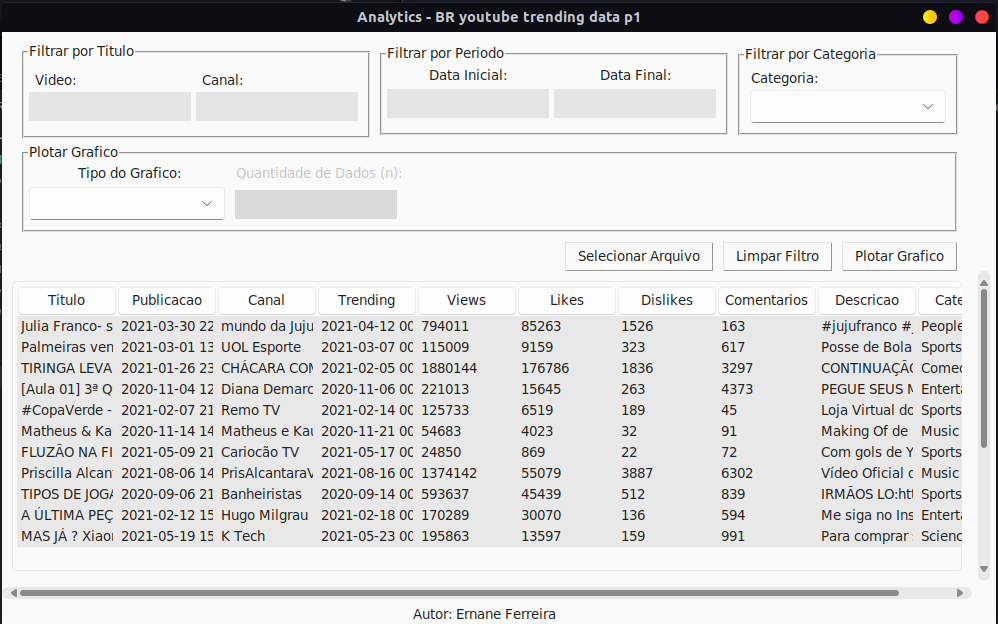
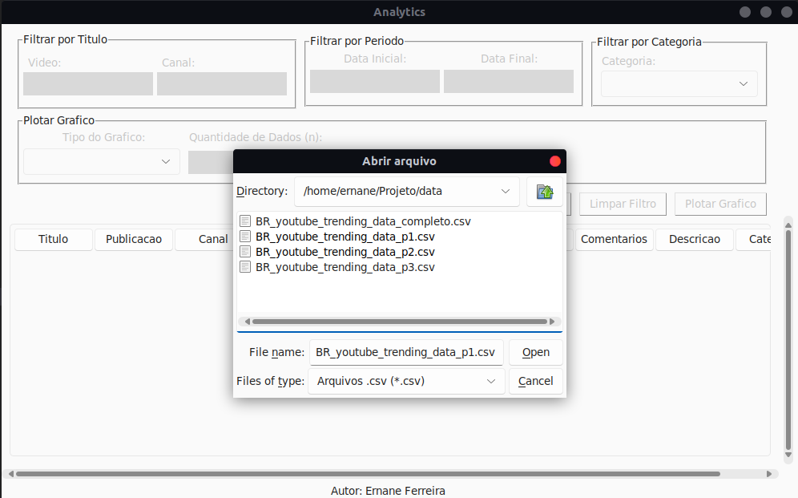
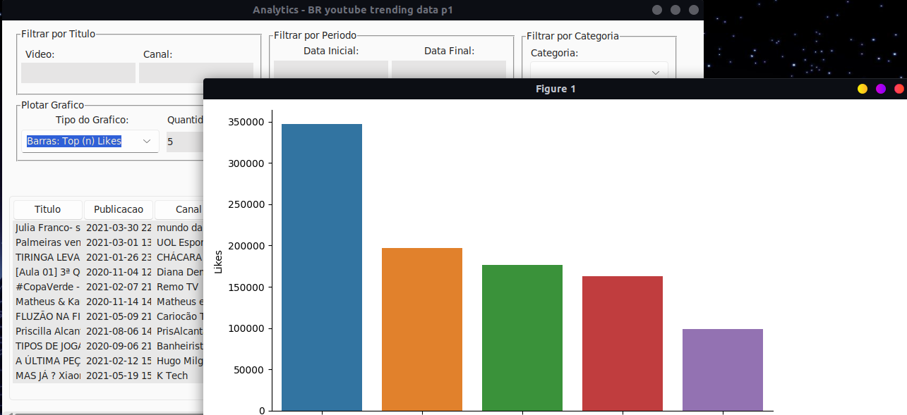

<h1 align="center">
  <strong>Youtube Analytics</strong>
</h1>

<div align="center">
  <a href="#-Tecnologias">Tecnologias</a>&nbsp;&nbsp;&nbsp;|&nbsp;&nbsp;&nbsp;
  <a href="#-Projeto">Projeto</a>&nbsp;&nbsp;&nbsp;|&nbsp;&nbsp;&nbsp;
  <a href="#-Use">Use</a>&nbsp;&nbsp;&nbsp;
</div>

<br>

<div align="center">
  
</div>

</p>

## 🚀 Tecnologias

Esta aplicação foi desenvolvida com as seguintes tecnologias:

- `Python` 3.8.10
  - `Tkinter` — Interface Python para `Tcl`/`Tk`
  - `Pandas` - Manipulação e análise de dados
  - `Matplotlib` - API orientada a objetos para embutir
  - `Seaborn` - Biblioteca de visualização de dados Python baseada em Matplotlib

## 💻 Projeto
<p>
Este projeto tem como objetivo fixar o estudo de Programação Orientada a Objetos tomando como base a linguagem Python, bem como, o padrão de projetos MVC (do inglês - model, view e conrollers). Dentre as suas funcionalidades, podemos contar com:

- [x] Leitura de dados em arquivos tipo `.csv`

<div align="center">
  
</div>

- [x] Filtragem desses dados por meio de:
  - [x] Titulo de Canal
  - [x] Titulo de Video
  - [x] Intervalo de tempo
  - [x] Categoria: 
    - [x] Education
    - [x] Entertainment
    - [x] Music
    - [x] Science & Technology
    - [x] People & Blogs
    - [x] Gaming
    - [x] Comedy
    - [x] Film & Animation
    - [x] Sports
    - [x] News & Politics
    - [x] Howto & Style
    - [x] Travel & Events
    - [x] Autos & Vehicles
    - [x] Pets & Animals
    - [x] Nonprofits & Activism
- [x] Plotagem de graficos de `Barras`, a partir de um conjunto de dados `n`, ou `Dispersão`.
  - [x]  Barras: Top (`n`) Views
  - [x]  Barras: Top (`n`) Comentarios
  - [x] Barras: Top (`n`) Likes
  - [x] Dispersão: Views e Comentários
  - [x] Dispersão: Views e Likes
  - [x] Dispersão: Comentários e Likes
<div align="center">
  
</div>
O projeto consiste basicamente em um sistema analítico com interface visual desktop para dados do `Trending top` de vídeos do youtube em um arquivo `.csv`. Com base nisso, após o sistema ler esses dados, disponibiliza todas as funções citadas anteriormente para o usuário estudá-los.

O mesmo também conta com tratamento de erros e exceções para que qualquer má utilização do sistema, vinda por parte do usuário, seja prevenida e lhe permita obter um retorno visual do erro, sendo utilizada a própria `GUI` (Graphical user interface) do sistema.
</p>

## 💡 Use
- <a href="./.github/projeto.zip" download>Baixe</a> o arquivo `.zip` do projeto

- Ou clone este repositorio
  ```bash
  $ git clone https://github.com/ErnaneJ/youtube-analytics.git
  ```
- Instale as <a href="./.github/dependencias.txt">Dependencias</a>
- Execute 
  ```bash
  $  python3 main.py
  ```
##### * se você quiser adicionar alguma nova funcionalidade, ou implementar alguma melhoria. Faça uma solicitação de pull, eu irei adorar receber!

---

<div align="center">
  Developed with ❤ by <a target="_blank" href="https://ernanej.github.io/my-linktree/">Ernane Ferreira</a>. 👋🏻
  <br/>
  <small>Projeto criado como projeto final do curso de <a href="https://github.com/ect-info/POO_2021.1">Programacao Orientada a Objetos (POO)</a> na <a href="https://www.ect.ufrn.br/">Escola de Ciencias e Tecnologia (ECT)</a> da <a href="https://www.ufrn.br/">Universidade Federal do Rio Grande do Norte (UFRN)</a> durante o semestre 2021.1.<small>
</div>
